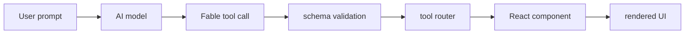

Fable UI keeps the model, tool schema, router, and component renderer separated. The model selects an allowlisted tool; the host app validates the payload; the UI renderer displays the matching component.

## Current flow



In the current app, `/api/chat` registers tools from `toolRegistry`, the model can emit Fable tool calls, and the chat UI renders `tool-*` message parts through the Fable tool renderer.

## Responsibilities

- The AI model chooses from registered tools.
- The AI SDK validates tool input against the schema.
- The tool router validates render payloads again before rendering.
- The React component receives typed props.
- The host app owns data access, permissions, and side effects.

## Data-backed path

`DataBrowser` can render static rows from a tool payload or fetch a host-owned resource through the data-source registry.

```txt
resourceId
-> resource registry
-> driver
-> host data source
-> rendered component
```

In that model, the agent receives a safe resource catalog and chooses an allowlisted `resourceId`. It does not invent SQL, Firestore queries, raw endpoints, collection paths, handler functions, or backend operations.

## Failure behavior

Unknown tool calls and invalid payloads should render fallback UI instead of crashing. The current router already handles invalid payloads by rendering the component error state. Unknown tools render a small fallback message.

## Next steps

Read [Agent Routing](/docs/architecture/agent-routing) for model selection rules and [Security](/docs/architecture/security) for trust boundaries.
