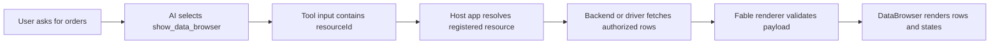

`DataBrowser` is the registry block for row-oriented AI answers. It covers two related tools:

- `show_table` renders a static table snapshot when the rows are already available.
- `show_data_browser` renders a richer browsing surface for search, filters, sorting, pagination, row detail, fullscreen review, and row actions.

Both tools live on this page because they share the same data model, table rendering internals, and safety boundary. The difference is intent: `ShowTable` answers with a bounded snapshot, while `DataBrowser` lets the user inspect a resource or a larger local row set.

<DataBrowserPreview />

## Installation

<RegistryInstallCommand itemName="data-browser" />

The `data-browser` registry item installs the browser surface, the table surface, shared hooks, internal table pieces, the tool definitions, manifests, and eval guidance:

```txt
components/fable-ui/data-browser/index.ts
components/fable-ui/data-browser/tool-definition.ts
components/fable-ui/data-browser/data-browser.tsx
components/fable-ui/data-browser/data-browser.types.ts
components/fable-ui/data-browser/show-table.tsx
components/fable-ui/data-browser/resolve-intent.ts
components/fable-ui/data-browser/hooks/use-data-browser-query.ts
components/fable-ui/data-browser/hooks/use-data-browser-actions.ts
components/fable-ui/data-browser/hooks/use-row-detail-surface.ts
components/fable-ui/data-browser/internal/inline-error.tsx
components/fable-ui/data-browser/internal/pagination-footer.tsx
components/fable-ui/data-browser/internal/responsive-detail-surface.tsx
components/fable-ui/data-browser/internal/row-detail.tsx
components/fable-ui/data-browser/internal/table-view.tsx
components/fable-ui/data-browser/internal/toolbar.tsx
components/fable-ui/data-browser/lib/cell-avatar.tsx
components/fable-ui/data-browser/lib/fallback-filters.ts
components/fable-ui/data-browser/lib/get-row-id.ts
lib/fable-ui/manifests/show-table.md
lib/fable-ui/manifests/show-data-browser.md
lib/fable-ui/evals/data-browser.md
```

The component depends on `ai`, `zod`, `class-variance-authority`, `lucide-react`, shared Fable `core`, and shadcn UI primitives such as card, button, badge, input, dialog, drawer, and select.

Install a driver only when `show_data_browser` should read real host-owned data from your backend. A driver belongs in your app, not in the model prompt. It fetches, authorizes, validates, and returns rows for an allowlisted resource.

<RegistryInstallCommand itemName="rest-driver" />

<RegistryInstallCommand itemName="firebase-driver" />

## Data flow

For static data, the model can call `show_table` or `show_data_browser` with safe `columns` and `rows` that are already present in the conversation.

For real backend data, the model should call `show_data_browser` with a `resourceId` from the host-provided resource manifest. The host app resolves that resource id through the registered data source, checks permissions, applies allowed filters and sorts, and sends safe rows back to the component. The model must not receive raw SQL, Firestore collection paths, REST endpoints, secrets, or authorization rules.



## Usage

This example is paste-ready. It includes dummy `columns` and `rows` so the component works out of the box.

```tsx
import { DataBrowser } from "@/components/fable-ui/data-browser/data-browser"

const columns = [
  { key: "customer", label: "Customer", sortable: true },
  { key: "orderNumber", label: "Order #", width: 132 },
  { key: "status", label: "Status", type: "badge", filterable: true },
  { key: "region", label: "Region", filterable: true },
  { key: "total", label: "Total", type: "currency", align: "right" },
]

const rows = [
  {
    id: "ord_1001",
    customer: "Nadia Ali",
    orderNumber: "1001",
    status: "paid",
    region: "Cairo",
    total: 420,
  },
  {
    id: "ord_1002",
    customer: "Mina Fahmy",
    orderNumber: "1002",
    status: "review",
    region: "Giza",
    total: 185,
  },
  {
    id: "ord_1003",
    customer: "Sarah Adel",
    orderNumber: "1003",
    status: "new",
    region: "Alexandria",
    total: 268,
  },
  {
    id: "ord_1004",
    customer: "Omar Saleh",
    orderNumber: "1004",
    status: "paid",
    region: "Mansoura",
    total: 512,
  },
]

export function OrdersBrowser() {
  return (
    <DataBrowser
      title="Orders"
      entityLabel="orders"
      columns={columns}
      rows={rows}
      pageSize={6}
      searchPlaceholder="Search orders"
    />
  )
}
```

## ShowTable

`show_table` is for static snapshots where rows are already available. It supports up to 200 rows with predictable pagination.

<ShowTablePreview />

Use it when an answer needs a compact list such as "recent orders", "top customers", "failed jobs", or "matching invoices". It should not be used when the user needs to browse a live resource, change filters repeatedly, inspect row detail, or trigger row actions.

```tsx
import { ShowTable } from "@/components/fable-ui/data-browser/show-table"

const columns = [
  { key: "customer", label: "Customer" },
  { key: "status", label: "Status", type: "badge" },
  { key: "total", label: "Total", type: "currency", align: "right" },
]

const rows = [
  { id: "ord_1001", customer: "Nadia Ali", status: "paid", total: 420 },
  { id: "ord_1002", customer: "Mina Fahmy", status: "review", total: 185 },
]

export function RecentOrdersTable() {
  return (
    <ShowTable
      title="Recent orders"
      description="A paginated static snapshot."
      columns={columns}
      rows={rows}
      pageSize={6}
    />
  )
}
```

## Tools

`show_data_browser` is for browsing, search, filter, sort, pagination, fullscreen inspection, or detail over host-owned data.

The model must not pass raw SQL, raw Firestore query code, secrets, or authorization decisions. The host supplies data access, allowed filters, allowed sort fields, permissions, and row actions.

Rows with avatar-like fields such as `avatar`, `avatarUrl`, `image`, `imageUrl`, `picture`, `pictureUrl`, `photo`, or `photoUrl` render a compact visual avatar in the first column. If no image URL is available, the table can fall back to initials from a name or title field.

## Tool definition

`components/fable-ui/data-browser/tool-definition.ts` exports both tools. The schemas describe safe column and row payloads, the AI SDK tool objects describe how the model can call them, and the renderer entries map validated tool parts to `<ShowTable />` or `<DataBrowser />`.

<ComponentSource src="components/fable-ui/data-browser/tool-definition.ts" title="components/fable-ui/data-browser/tool-definition.ts" />

## States

The previews above include the same states the tool renderer can produce:

| State | How it renders |
| --- | --- |
| Ready | Validated rows, columns, filters, sort, and detail settings render normally. |
| Loading | Skeleton table UI renders while a tool part streams or the host marks the part as loading. |
| Empty | The table renders an empty state when no rows are available. |
| Error | The component receives an error object when the tool errors or schema validation fails. |
| Disabled | Controls render locked when the host marks the part as disabled. |

## Manifests

Manifests are copyable routing contracts. They tell the model when to pick a component, when to avoid it, and how to choose between neighboring tools. Read the [Manifests guide](/docs/manifests) for the full convention.

### `show_table`

<ComponentSource src="lib/fable-ui/manifests/show-table.md" title="lib/fable-ui/manifests/show-table.md" language="md" />

### `show_data_browser`

<ComponentSource src="lib/fable-ui/manifests/show-data-browser.md" title="lib/fable-ui/manifests/show-data-browser.md" language="md" />

## Choosing between them

Use `show_table` when the rows are already available in the tool payload. Use `show_data_browser` when the model should select a registered host-owned resource by `resourceId` or when the user needs search, filters, sort, pagination, row detail, or fullscreen review.
